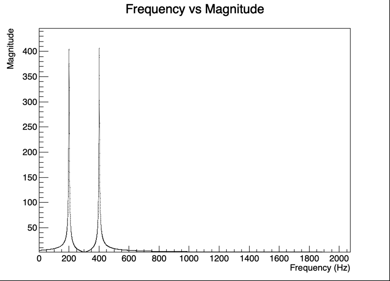

# Implementations of Spinach tutorials using C++

[Spinach's tutorials](https://github.com/IlyaKuprov/Spinach/tree/main/examples/tutorials)

# Requirements  
Install the following libraries
- [Eigen](https://eigen.tuxfamily.org/dox/index.html)
- [root](https://github.com/root-project/root)

# Build  
1. Clone this repository and change directory to `examples/tutorials`  
```shell
https://github.com/vsavkov/spinach-cpp.git
cd examples/tutorials
```
2. Set path to the `Eigen` library in `CMakeLists.txt`  
This step can be omitted if the path to the `Eigen` library will be provided in `CMake` command line 
```CMake
set(EIGEN_ROOT "path/to/eigen/library")
```
3. Run `CMake` to build executables
```shell
mkdir build
cd build
cmake .. -DEIGEN_ROOT=path/to/eigen/library -DCMAKE_BUILD_TYPE=Release
make
```
4. Run executables  
```shell
./getting_started_with_sims
```

# Implemented tutorials  
### [Getting started with NMR simulations - Describing a single quantum system](https://github.com/IlyaKuprov/Spinach/blob/main/examples/tutorials/getting_started_with_sims.pdf)
##### Implementation: `getting_started_with_sims.cpp`  
Produces:  
- `single_quantum_system_spectrum.csv`
- `single_quantum_system_spectrum.png`
---
